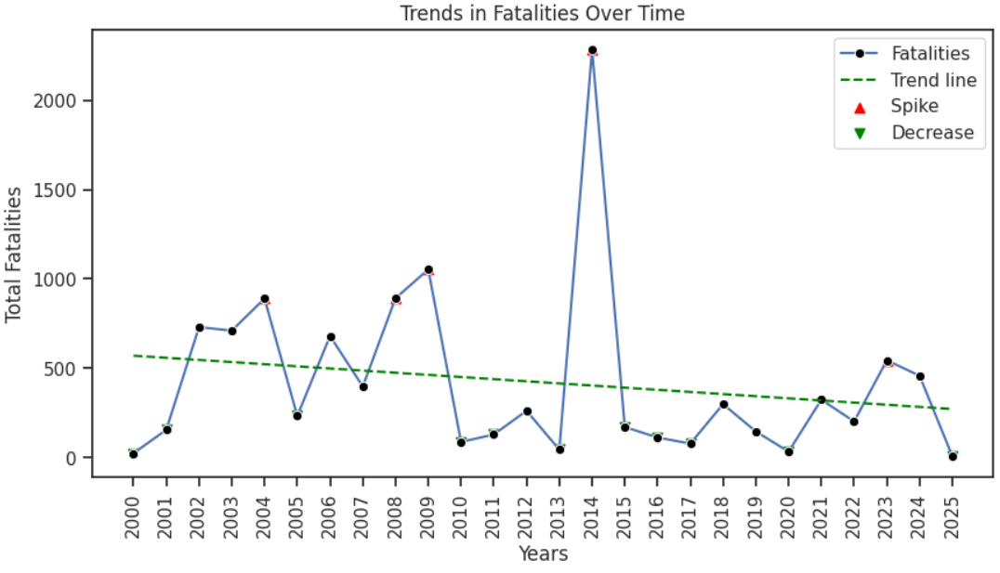
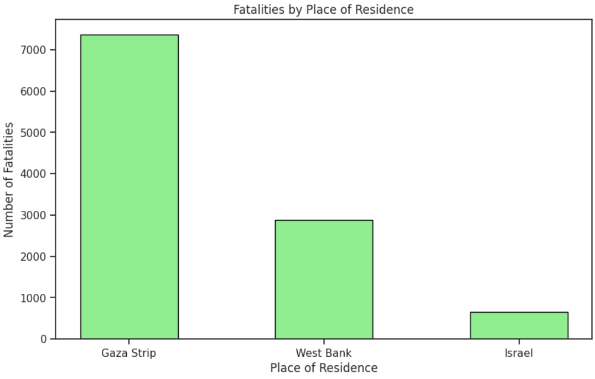
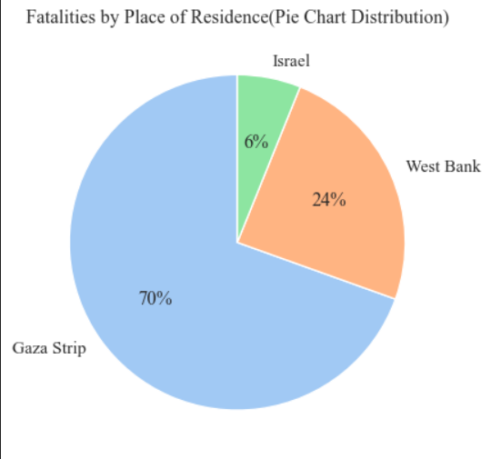
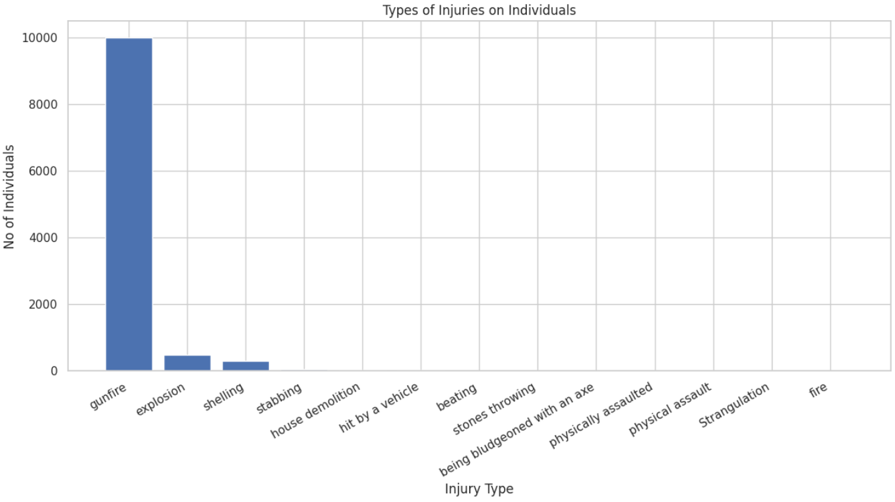
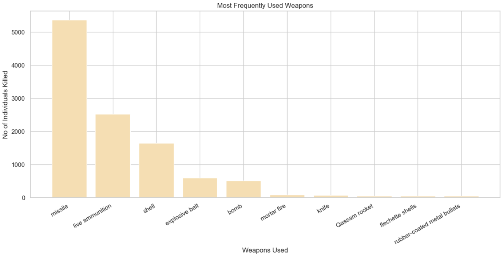
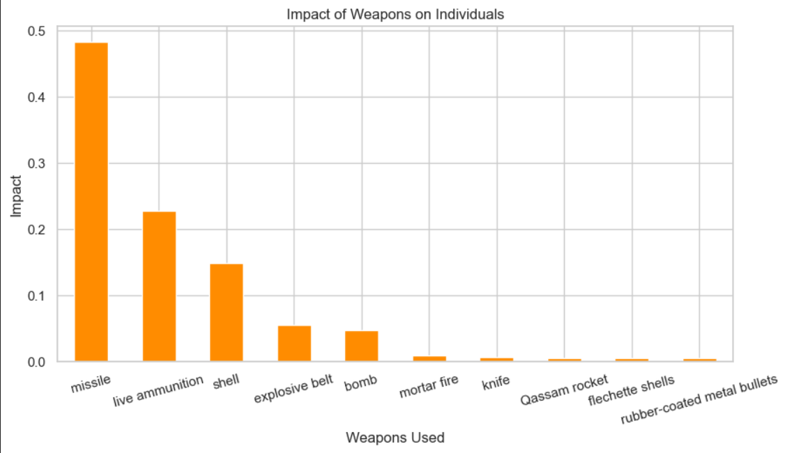
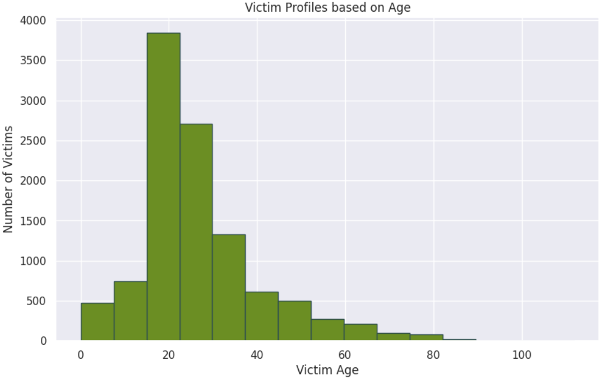
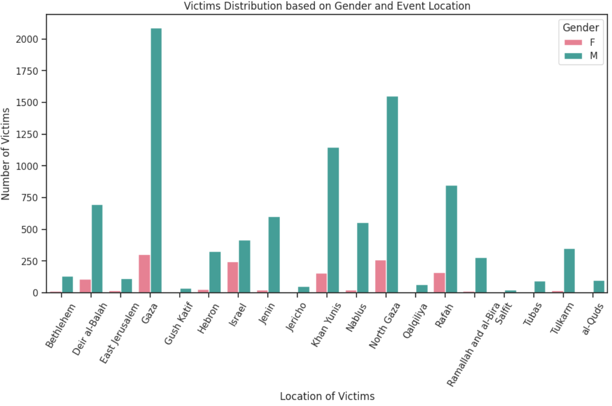
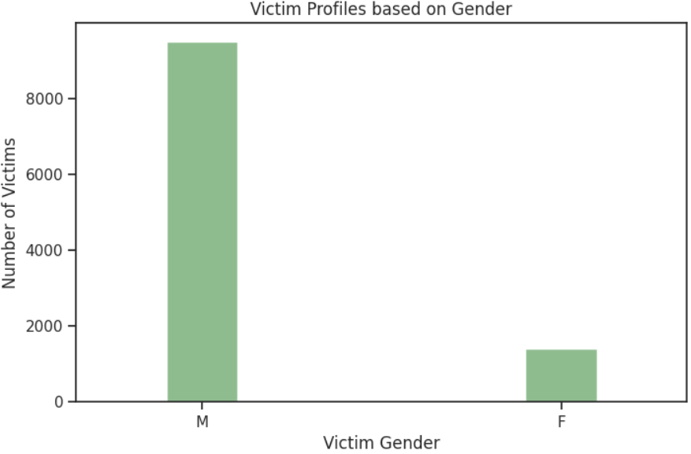
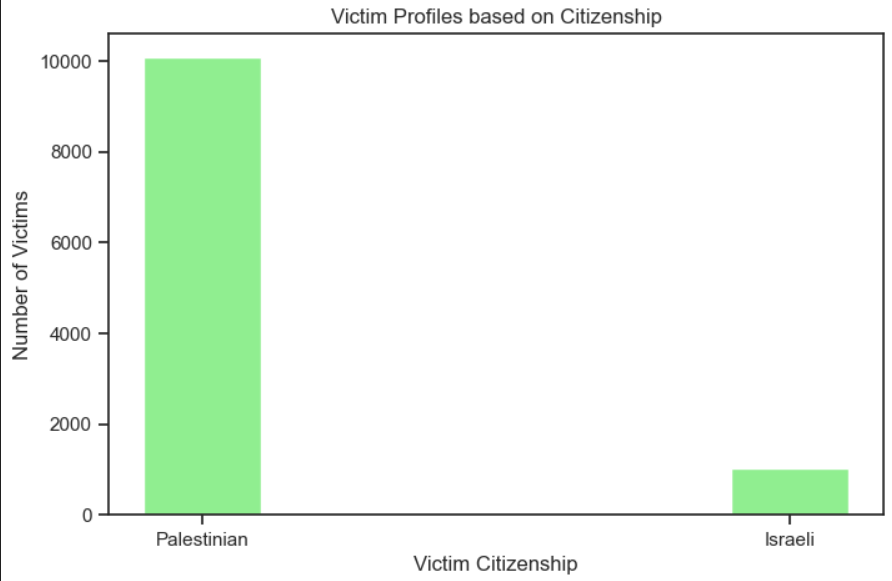

# Palestine-Israel Conflict Data Analysis

This project provides an in-depth data analysis of fatalities in the Palestine-Israel conflict using a dataset containing demographic, geographic, and event-specific information.

---

## 🌐 Data Sources

The dataset is derived and compiled from:

- [B’Tselem – Fatalities Statistics](https://statistics.btselem.org/en/intro/fatalities)
- [B’Tselem – Demolitions Statistics](https://statistics.btselem.org/en/intro/demolitions)

These sources provide verified public data on casualties, injuries, and infrastructure impact in the conflict region.

---

## 📊 Objective

The primary goal is to explore patterns and trends in conflict-related fatalities using visual and statistical tools. This includes identifying temporal spikes, demographic profiles, injury types, weapons used, and regional impact.

---

## 📁 Dataset

- **File Used**: `fatalities.csv`
- **Fields Include**:
  - `date_of_death`, `age`, `gender`, `citizenship`, `type_of_injury`, `ammunition`, `event_location_region`, etc.

---

## 🧪 Analysis Performed

### 🔹 Task 1: Yearly Fatality Trends
- Converted `date_of_death` to datetime.
- Grouped fatalities by year.
- Detected abnormal spikes or declines based on a residual threshold.
- Visualized trends with line plots and highlighted anomalies.

### 🔹 Task 2: Demographic Analysis
- Descriptive statistics on age, gender, citizenship.
- Multi-variable plots showing age vs fatalities by gender and citizenship.

### 🔹 Task 3: Geographical Distribution
- Identified top 10 regions with the highest fatalities.
- Visualized using both bar and pie charts.

### 🔹 Task 4: Injury Types
- Ranked most common types of injuries.
- Represented data using a bar chart.

### 🔹 Task 5: Weapons Used
- Highlighted top 10 weapons involved in fatalities.
- Calculated relative impact and visualized with bar plots.

### 🔹 Task 6: Victim Profiling
- Age distribution histogram.
- Victim count by gender and event location.
- Separate bar charts for gender and citizenship.

---

## 📷 Screenshots

### 1. Yearly Fatality Trend and Spikes


### 2. Fatalities by Age and Gender


### 3. Top Regions with Fatalities



### 4. Types of Injuries


### 5. Weapons Used and Impact



### 6. Victim Profile





> 📁 All screenshots can be found in the `screenshots/` folder.

---

## 🛠 Requirements

Install required libraries using:

```bash
pip install pandas numpy matplotlib seaborn

